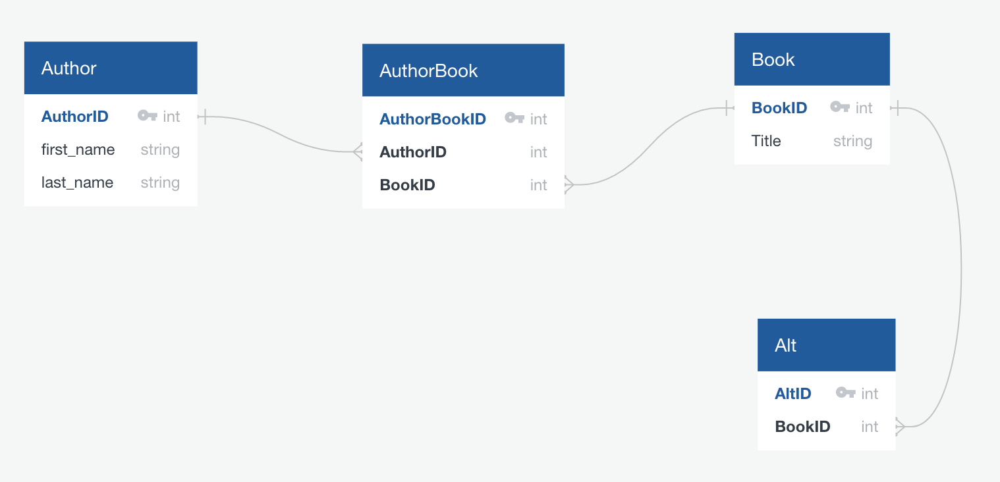

# README

Simple library app to look up books by title and author, as well as mark books as duplicates of others.

## Domain Model



## Database Integrity and Model Testing

To run all model unit tests: from the console, run:

```
rspec spec/models/
```

To run all routing specs: from the console, run:

```
rspec spec/routing/
```

Models and database are tested for:

- Proper validation upon model creation
- Destruction of dependent model upon model deletion
- Database integrity when converting Book References to Duplicates (labeled as Book and Alts, respectively), and vice versa

## Note:

- Currently, if book has duplicate(s), and is converted to duplicate itself, all of its duplicates will be destroyed. Intended behavior: disallow conversion to duplicate if book has duplicates. Thus, final test in book_spec.rb, which tests this behavior, is pending.
